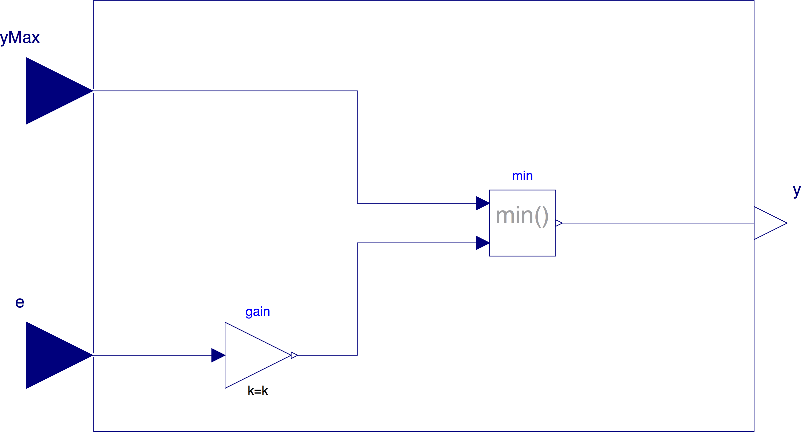

.. _sec_specification:

CDL Specification
-----------------

This section gives a high-level specification of
the Control Description Language CDL.

The CDL constists of the following elements:

* A list of elementary control blocks, such as a block that adds two signals and outputs the sum,
  or a block that represents a PID controller.
* Permissible data types.
* Syntax to specify

  * how to instantiate these blocks and assign values of parameters, such as a proportional gain.
  * how to connect inputs of blocks to outputs of other blocks.
  * how to document blocks.
  * how to add annotations such as for graphical rendering of blocks
    and their connections.
  * How to specify composite blocks.

* A model of computation that describes when blocks are executed and when
  outputs are assigned to inputs.

In order to easily process CDL, we will use a subset of the Modelica specification
for the implementation of CDL. The next sections explain this subset.

List of elementary building blocks
^^^^^^^^^^^^^^^^^^^^^^^^^^^^^^^^^^

The CDL contains elementary building blocks that are used to compose
control sequences. The list of elementary building blocks is as shown
on [fixme: add link to web site, that will show a list with block such as]

.. code-block:: modelica

   block AddParameter "Outputs the sum of a parameter and a signal"
     parameter Real p "Value to be added to input";
     RealInput u "Input signal";
     RealOuput y "Output signal";

     annotation(Documentation(info(
     

     Block that outputs <code>y = p + u</code>.
     
));
   end AddParameter;

.. todo::

   The following blocks are missing in the current Modelica library:

   * Block that adds a parameter to a signal.
   * Temperature setback for heating.
   * Counter

.. todo::

   Should a GPC 36 sequence also be an elementary building block so
   that manufacturers can implement them in a library, or should
   they be only composed of smaller blocks?

Permissible data types
^^^^^^^^^^^^^^^^^^^^^^

The basic data types are, in addition to the elementary building blocks,
`Real`, `Integer`, `Boolean`, `String`, and enumeration types.
See also the Modelica 3.3 specification, Chapter 3.
All specifications in CDL must be blocks or parameters.
Variables are not allowed [they are used however in the elementary building blocks].

Syntax
^^^^^^

The syntax is a proper subset of Modelica as needed to instantiate
classes, assign parameters, connect objects and document classes.

The following Modelica keywords are not supported in CDL:

#. `redeclare`
#. `constrainedby`
#. `inner` and `outer`

Also, the following Modelica language features are not supported in CDL:

#. Clocks [which are used in Modelica for hybrid system modeling].
#. `algorithm` sections. [As the elementary building blocks are black-box
   models as far as CDL is concerned and thus CDL compliant tools need
   not parse the `algorithm` section.]
#. `initial equation` and `initial algorithm` sections
#. package-level declaration of `constant`

Instantiation
^^^^^^^^^^^^^

Instantiation is identical as in Modelica.

[For example, to instantiate a gain, one would write

.. code-block:: modelica

   Continuous.Gain myGain(k=-1) "Constant gain of -1" annotation(...);

where the documentation string and the annotation are both optional.
The optional annotations is typically used
for the graphical positioning of the instance in a block-diagram.
]

.. todo::

   We need to clarify whether

   #. We allow operations such as `Continuous.Gain myGain(k=10*60);`?
   #. We allow conditional removal of blocks, such as
      such as `Continuous.Gain myGain(k=10*60) if useGain;`?

Connections
^^^^^^^^^^^

Each input of a block needs to be connected to exactly one output of another block.
Connections are listed after the instantiation of the blocks in an equation
section. The syntax is

.. code-block:: modelica

   connect(port_a, port_b) annotation(...);

where `annotation(...)` is optional and may be used to declare
the graphical rendering of the connection.
The order of the connections and the order of the arguments in the
`connect` statement does not matter.

[For example, to connect an input `u` of an instance `gain` to the output
`y` of an instance `timer`, one would declare

.. code-block:: modelica

   Continuous.Timer timer "Timer";
   Continous.Gain gain(k=60) "Gain";

   equation
     connect(gain.u, timer.y);
   // fixme: need to replace signals with signals from OpenBuildingControl
]

Signals must be connected using `connect` statement;
direct assigning the values of signals when instantiating
signals is not allowed.

[This ensures that all control sequences are expressed as a block diagrams.
For example, the following model is valid

.. literalinclude:: img/specification/MyAdderValid.mo
   :language: modelica
   :linenos:

whereas the following model is not valid in CDL, although it is valid in Modelica

.. literalinclude:: img/specification/MyAdderInvalid.mo
   :language: modelica
   :linenos:
   :emphasize-lines: 4
]

Annotations
^^^^^^^^^^^

Annotations follow the same rules as described in the following
Modelica 3.3 Specification

* 18.2 Annotations for Documentation
* 18.6 Annotations for Graphical Objects, with the exception of

  * 18.6.7 User input

* 18.8 Annotations for Version Handling

[For CDL, annotations are primarily used for graphical layout of blocks, their connections
and of input signal and output signal connectors, and to declare
vendor annotation (Sec. 18.1 in Modelica 3.3 Specification).]

Composite blocks
^^^^^^^^^^^^^^^^

CDL allows building composite blocks such as shown in
:numref:`fig_custom_control_block`.

.. _fig_custom_control_block:

   Example of a composite control block that outputs :math:`y = \max( k \, e, \, y_{max})`
   where :math:`k` is a constant.

Composite blocks can contain other composite blocks.

Each composite block must be stored on the file system under the name of the composite block
with the file extension `.mo`, and with each package name being a directory.
The name must be an allowed Modelica class name.

[For example, if a user specifies a new composite block `MyController.MyAdder`, then it
must be stored in the file `MyController/MyAdder.mo` on Linux or OS X, or `MyController\\MyAdder.mo`
on Windows.]

[ The following statement, when saved as `CustomPWithLimiter.mo`, is the
declaration of the composite block shown in :numref:`fig_custom_control_block`

.. literalinclude:: img/specification/CustomPWithLimiter.mo
   :language: modelica
   :linenos:

Composite blocks are need to preserve grouping of control blocks and their connections,
and are needed for hierarchical composition of control sequences.]

Model of computations
^^^^^^^^^^^^^^^^^^^^^

CDL uses the synchronous data flow principle and the single assignment rule,
which are defined below. [The definition is adopted from and consistent with the Modelica 3.3 Specification, Section 8.4.]

#. All variables keep their actual values until these values
   are explicitly changed. Variable values can be accessed at any time instant.
#. Computation and communication at an event instant does not take time.
   [If computation or communication time has to be simulated, this property has to be explicitly modeled.]
#. Every input connector must be connected to exactly one output connector.

In addition, the dependency graph from inputs to outputs that directly depend
on inputs must be directed and acyclic.
I.e., connections that form an algebraic loop are not allowed.
[To break an algebraic loop, one could place a delay block or an integrator
in the loop, because the outputs of a delay or integrator does *not* depend
directly on the input.]

.. todo::

   In simulation, we likely need to use discrete event or discrete time semantics
   for reasons of computing speed, but actual control systems use discrete time
   sampled systems. We need to address how to sample the control blocks in
   simulation, in the actual implementation, and in the verification tool [as
   they all have different needs on performance, predictability of computing time,
   and scheduling of execution].
