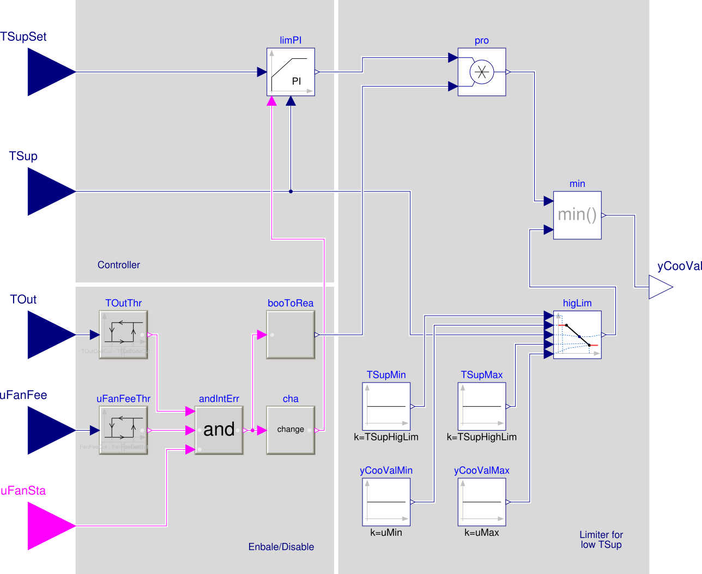
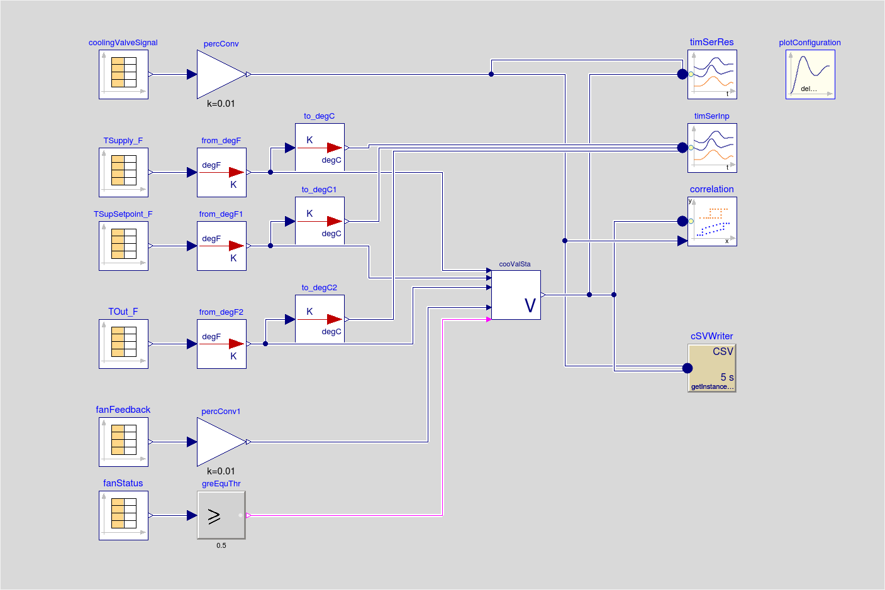

.. _sec_verification:

Verification
------------

This section describes the verification
of the control sequences that can be done as part
of the commissioning, e.g., step 9 in the process shown in
:numref:`fig_process`.
For the requirements, see :numref:`sec_requirements_verification_tool`.

Scope of the verification
^^^^^^^^^^^^^^^^^^^^^^^^^

For OpenBuildingControl, we currently only verify the control
sequence. Outside the scope of our verification are tests
that verify whether the I/O points are connected properly,
whether the mechanical equipment is installed and functions correctly,
and whether the building envelop is meeting the specifications.
Therefore, with our tests, we aim to verify that the control provider
implemented the sequence as specified, and that it executes correctly.

Methodology
^^^^^^^^^^^

A typical usage would be as follows: Given a CDL specification,
a commissioning agent would export trended control inputs and outputs
to a CSV file. The commissioning agent then executes the CDL specification
for the trended inputs, and compares the following:

* Whether the trended outputs and the outputs computed by the CDL specification
  are close to each other.
* Whether the trended inputs and outputs lead to the right sequence diagrams,
  for example, whether an airhandler's economizer outdoor air damper is fully open when
  the system is in free cooling mode.

:numref:`fig_con_seq_ver` shows the flow diagram for the verification.
Rather than using real-time data through BACnet or other protocols,
set points, inputs and outputs of the actual controller
are stored in an archive such as a CSV file or a data base.
This allows to reproduce the verification tests, and it does
not require the verification tool to have access to the actual building
control system.
During the verification, the archived data are read into a Modelica
model that conducts the verification.
The verification will use three blocks.
The block labeled *input file reader* reads the archived data,
which may typically be in CSV format. As this data may be directly written
by a building automation system, its units will differ from the units
used in CDL. Therefore, the block called *unit conversion* converts
the data to the units used in the CDL control specification.
Next, the block labeled *control specification*
is the control sequence specification in CDL format.
This is the specification that was exported during design and sent
to the control provider.
Given the set point and measurement signals, it outputs the control signal
according to the specification.
The block labeled *time series verification* compares this output with
trended control signals, and indicates where the signals differ by more than
a prescribed tolerance, both, in time and in signal value.
The block labeled *sequence chart* creates x-y or scatter plots. These
can be used to verify for example that an economizer outdoor air damper
has the expected position as a function of the outside air temperature.

Below, we will further describe the blocks  *time series verification*
and *sequence chart*.

.. todo:: Do we also need a block to do unit conversion?
          A block to read CSV data is in development.

.. _fig_con_seq_ver:

.. figure:: img/verification/overviewBlockDiagram.*
   :width: 700 px

   Overview of the verification that tests whether the installed
   control sequence meets the specification.

.. note:: We also considered testing for criteria such as "whether room temperatures
          are satisfactory" or "a damper control signal is not oscillating". However,
          discussions with design engineers and commissioning providers showed that
          there is currently no accepted method for turning such questions into
          hard requirements. We implemented software that tests for example
          criteria such as
          "Room air temperature shall be within the setpoint +/- 0.5 Kelvin
          for at least 45 min within each 60 min window." and
          "Damper signal shall not oscillate more than 4 times per hour
          between a change of +/- 0.025 (for a 2 minute sample period)".
          Software implementations of such tests are available on
          the Modelica Buildings Library github repository, commit
          `454cc75 <https://github.com/lbl-srg/modelica-buildings/commit/454cc7521c0303d0a3f903acdda2132cc53fe45f>`_.

          Besides these tests, we also considered automatic fault detection and diagnostics methods
          that were proposed for inclusion in ASHRAE RP-1455 and Guideline 36,
          and we considered using methods such as in :cite:`Veronica2013`
          that automatically detect
          faulty regulation, including excessively oscillatory behavior.
          However, as it is not yet clear how sensitive these methods
          are to site-specific tuning, and because field tests are ongoing in a NIST project,
          we did not implement them.

Modules of the verification test
^^^^^^^^^^^^^^^^^^^^^^^^^^^^^^^^

File reader
~~~~~~~~~~~

xxxx [Michael to describe CSV reader that is currently developed]

Unit conversion
~~~~~~~~~~~~~~~

Building automation systems store physical quantities in various units.
To convert them to the units used by Modelica and hence also by CDL,
we developed the package ``Buildings.Controls.OBC.UnitConversions``.
This package provides blocks that convert common units to SI units, and
from SI units to units that are commonly used in the HVAC community.

[todo: This package needs to be implemented.
As there will be many blocks, it should be generated from a json file
using code in Buildings/Resources/src/Controls]

Comparison of time series data
~~~~~~~~~~~~~~~~~~~~~~~~~~~~~~

xxxx
[Jianjun to document the time series comparison tool.]

Verification of sequence diagrams
~~~~~~~~~~~~~~~~~~~~~~~~~~~~~~~~~

To verify sequence diagrams we developed the Modelica package
``Buildings.Utilities.IO.Plotters``.
:numref:`fig_vav_sin_mod_ver` shows an example in which this block is used to produce the sequence
diagram shown in :numref:`fig_vav_sin_plo_dia_ver`. While in this example, we used the control
output of the CDL implementation of the control sequence, during commissioning,
one would use the control signal from the building automation system.

.. _fig_vav_sin_mod_ver:

.. figure:: img/verification/SingleZoneVAVSupply_u.*
   :width: 700 px

   Modelica model that verifies the sequence diagram.
   On the left are the blocks that generate the control input.
   In a real verification, these would be replaced with a file reader that
   reads data that have been archived by the building automation system.
   In the center is the control sequence implementation.
   Some of its output is converted to degree Celsius, and then fed to the
   plotters on the right that generate a scatter plot for the temperatures
   and a scatter plot for the fan control signal.
   The block labelled ``plotConfiguration`` configures
   the file name for the plots and the sampling interval.

.. _fig_vav_sin_plo_dia_ver:

.. figure:: img/verification/VAVSingleZoneTSupSet.*
   :width: 500 px

   Control sequence diagram for the VAV single zone control sequence
   from ASHRAE Guideline 36.

Simulating the model shown in :numref:`fig_vav_sin_mod_ver`
generates a file that contains the scatter plots shown in :numref:`xxxx`

.. _fig_vav_sin_ger_ver:

.. figure:: img/verification/xxxx.*
   :width: 500 px

   Scatter plots that show the control sequence diagram generated from
   the outputs of the simulated control sequence.

Example
^^^^^^^

[Pending approval: building name, ALC logic diagram]

In this example we validated a trended output of a control sequence that defines the cooling
coil valve position. The cooling coil valve sequence is a part of the ALC EIKON control logic 
implemented in {fixme building and ahu name} in Berkeley, CA. The subsequence comprises a PI
controller that tracks the supply air temperature, an upstream subsequence that enables the 
controller and a downstream output limiter in case of low supply air temperatures.

.. figure:: img/verification/xxxx.* {fixme after we obtain permission}
   :width: 500 px
   
   ALC EIKON specification of the cooling coil valve position control sequence
   
We created a CLD specification of the same cooling coil valve position control sequence in order to
validate the recorded output.

   
   OBC specification of the cooling coil valve position control sequence

Recorded 5s input trends to the subsequence are:

* Supply air temperature [F]
* Supply air temperature setpoint [F]
* Outdoor air temperature [F]
* VFD fan enable status [0/1]
* VFD fan feedback [%]

Output trend of the subsequence is:

* Cooling coil valve position [%]

The input and output trends were processed using a csv to mos conversion script [fixme: maybe add link]. 
The data used in the example begins at midnight on June 7 2018.

A Modelica model that conducts the verification reads the input and output
trends in, generates the output of the OBC cooling coil valve sequence specification 
using the recorded inputs and compares that output to the trended one.

   
   A Modelica model that conducts the verification
   
We obtained a good fit between the trend and the modeled output.

.. figure:: img/verification/cooling_valve_validation.html
   :width: 800 px
   
   Verification results

   
   

